<!-- _class: lead -->
<!-- _paginate: false -->

# Charte Graphique — Standard

## Design System v3.0 — Neon Edition

Fond sombre — Glass-morphism — Glow subtil — Transitions

---

<!-- _class: compact -->

## Typographie

### Titre H3 — Texte clair

Le texte courant est en `#e2e8f0` sur fond `#0f172a`.

Le **gras** utilise `#93c5fd` avec glow. L'*italique* utilise `#c4b5fd` avec glow.

Le `code inline` : fond transparent + bordure subtile + micro-glow.

```
Bloc de code : fond rgba(30,41,59,0.8)
Bordure + box-shadow bleu 0.1
```

---

<!-- _class: compact -->

## Tableau standard

| Colonne A | Colonne B | Colonne C | Colonne D |
|-----------|-----------|-----------|-----------|
| Cellule 1 | Cellule 2 | Cellule 3 | Cellule 4 |
| Cellule 5 | Cellule 6 | Cellule 7 | Cellule 8 |
| Cellule 9 | Cellule 10 | Cellule 11 | Cellule 12 |

Header `rgba(30,58,138,0.6)`. Table `box-shadow: 0 0 12px rgba(59,130,246,0.08)`. Coins arrondis.

---

<!-- transition: flip -->

## Tableau — Meilleur element

Coloration par **ligne** : le meilleur element est vert, le pire est rouge.

<table style="width: 100%;">
<thead><tr><th>Modele</th><th>Coverage</th><th>Cout</th><th>Temps</th><th>Verdict</th></tr></thead>
<tbody>
<tr><td class="rank-top">GPT-5.4 Nano</td><td class="rank-top">82.4%</td><td>$0.020</td><td>90s</td><td class="rank-top">Champion</td></tr>
<tr><td class="rank-mid">Gemini 2.0 Flash</td><td class="rank-mid">70.6%</td><td>$0.005</td><td>40s</td><td class="rank-mid">Backup</td></tr>
<tr><td class="rank-bottom">DeepSeek V3.2</td><td class="rank-bottom">20.6%</td><td>$0.010</td><td>401s</td><td class="rank-bottom">Faible</td></tr>
</tbody>
</table>

---

<!-- transition: flip -->

## Tableau — Meilleures donnees

Coloration par **cellule** : chaque colonne a son propre meilleur, independamment des autres.

<table style="width: 100%;">
<thead><tr><th>Modele</th><th>Coverage</th><th>Cout</th><th>Temps</th><th>Fiabilite</th><th>Verdict</th></tr></thead>
<tbody>
<tr><td>GPT-5.4 Nano</td><td class="rank-top">82.4%</td><td class="rank-mid">$0.020</td><td class="rank-mid">90s</td><td class="rank-top">99.2%</td><td>Polyvalent</td></tr>
<tr><td>Gemini 2.0 Flash</td><td class="rank-mid">70.6%</td><td class="rank-top">$0.005</td><td class="rank-top">40s</td><td class="rank-mid">95.1%</td><td>Rapide &amp; cheap</td></tr>
<tr><td>Claude Haiku 4.5</td><td class="rank-mid">68.3%</td><td class="rank-mid">$0.015</td><td class="rank-mid">75s</td><td class="rank-mid">97.8%</td><td>Equilibre</td></tr>
<tr><td>DeepSeek V3.2</td><td class="rank-bottom">20.6%</td><td class="rank-mid">$0.010</td><td class="rank-bottom">401s</td><td class="rank-bottom">72.0%</td><td>A eviter</td></tr>
</tbody>
</table>

Ici, GPT-5.4 domine en coverage et fiabilite, mais Gemini gagne en cout et temps.

---

<!-- transition: fade -->

<!-- _class: compact -->

## Info Boxes

<div class="box la l1-blue" style="margin-bottom: 0.5rem;">
<strong>Info</strong> — Neutre, informatif. Glow bleu subtil.
</div>

<div class="box la l1-green" style="margin-bottom: 0.5rem;">
<strong>Succes</strong> — Validation, resultat positif. Glow vert.
</div>

<div class="box la l1-orange" style="margin-bottom: 0.5rem;">
<strong>Attention</strong> — Warning, limitation. Glow ambre.
</div>

<div class="box la l1-red">
<strong>Danger</strong> — Erreur, critique, bloquant. Glow rouge.
</div>

---

<!-- transition: flip -->

<!-- _class: compact -->

## KPI Cards

<div style="display: flex; gap: 0.8rem; justify-content: center; flex-wrap: wrap;">
  <div class="box l1-blue" style="padding: 0.8rem 1.2rem; text-align: center; min-width: 130px;">
    <div style="font-size: 1.8em; font-weight: 800; text-shadow: 0 0 12px rgba(96,165,250,0.4);">7 200+</div>
    <div style="font-size: 0.75em; opacity: 0.75;">Videos indexees</div>
  </div>
  <div class="box l1-violet" style="padding: 0.8rem 1.2rem; text-align: center; min-width: 130px;">
    <div style="font-size: 1.8em; font-weight: 800; text-shadow: 0 0 12px rgba(167,139,250,0.4);">487</div>
    <div style="font-size: 0.75em; opacity: 0.75;">Sources</div>
  </div>
  <div class="box l1-green" style="padding: 0.8rem 1.2rem; text-align: center; min-width: 130px;">
    <div style="font-size: 1.8em; font-weight: 800; text-shadow: 0 0 12px rgba(52,211,153,0.4);">30K+</div>
    <div style="font-size: 0.75em; opacity: 0.75;">Entites</div>
  </div>
  <div class="box l1-orange" style="padding: 0.8rem 1.2rem; text-align: center; min-width: 130px;">
    <div style="font-size: 1.8em; font-weight: 800; text-shadow: 0 0 12px rgba(251,191,36,0.4);">~$14</div>
    <div style="font-size: 0.75em; opacity: 0.75;">/mois</div>
  </div>
</div>

KPI : `box-shadow: 0 0 12px rgba(couleur, 0.15)`. Chiffre : `text-shadow: 0 0 12px rgba(couleur, 0.4)`.

---

<!-- transition: fade -->

<!-- _class: compact -->

## Steps numerotes

<div style="display: flex; flex-direction: column; gap: 0.4rem; font-size: 0.88em;">
<div style="display: flex; align-items: center; gap: 0.7rem;">
  <div class="box l2-blue" style="padding: 0.35rem 0.7rem; min-width: 34px; text-align: center; font-weight: 800; font-size: 1.1em;">1</div>
  <div class="box la l1-blue" style="flex: 1;"><strong>Decouverte</strong> — Ajout de sources YouTube, RSS, sites web</div>
</div>
<div style="display: flex; align-items: center; gap: 0.7rem;">
  <div class="box l2-violet" style="padding: 0.35rem 0.7rem; min-width: 34px; text-align: center; font-weight: 800; font-size: 1.1em;">2</div>
  <div class="box la l1-violet" style="flex: 1;"><strong>Scraping</strong> — Innertube API (50 vid/s) + Transcripts</div>
</div>
<div style="display: flex; align-items: center; gap: 0.7rem;">
  <div class="box l2-green" style="padding: 0.35rem 0.7rem; min-width: 34px; text-align: center; font-weight: 800; font-size: 1.1em;">3</div>
  <div class="box la l1-green" style="flex: 1;"><strong>Enrichissement</strong> — Analyse LLM structuree</div>
</div>
</div>

Pastille (L2) + Barre (L1) : imbrication visuelle coherente.

---

<!-- _class: compact -->

## Cards 3 colonnes

<div style="display: flex; gap: 0.8rem;">
<div class="box l1-red" style="flex: 1; border-top: 3px solid var(--red-border); padding: 0.7rem;">
<div style="font-weight: 800; font-size: 0.95em;">Gate 1</div>
<div style="font-weight: 700; font-size: 0.82em; opacity: 0.85;">ConstraintGates</div>
<div style="font-size: 0.72em; opacity: 0.75;">Qualite donnees : JSON valide, entities &gt; 0</div>
</div>
<div class="box l1-blue" style="flex: 1; border-top: 3px solid var(--blue-border); padding: 0.7rem;">
<div style="font-weight: 800; font-size: 0.95em;">Gate 2</div>
<div style="font-weight: 700; font-size: 0.82em; opacity: 0.85;">Judge _extras</div>
<div style="font-size: 0.72em; opacity: 0.75;">42 params auto-ajustes</div>
</div>
<div class="box l1-green" style="flex: 1; border-top: 3px solid var(--green-border); padding: 0.7rem;">
<div style="font-weight: 800; font-size: 0.95em;">Gate 3</div>
<div style="font-weight: 700; font-size: 0.82em; opacity: 0.85;">HarnessGates</div>
<div style="font-size: 0.72em; opacity: 0.75;">Sante operationnelle</div>
</div>
</div>

---

<!-- _class: compact -->

## Comparatif 2 colonnes

<div style="display: flex; gap: 1rem;">
<div class="box la l1-green" style="flex: 1; padding: 0.8rem;">
<div style="font-size: 0.85em; font-weight: 700;">GPT-5.4 Nano (Champion)</div>
<div style="font-size: 1.8em; font-weight: 800; text-shadow: 0 0 12px rgba(52,211,153,0.35);">82.4%</div>
<div style="font-size: 0.8em; opacity: 0.8;">$0.02/vid — 90s</div>
</div>
<div class="box la l1-red" style="flex: 1; padding: 0.8rem;">
<div style="font-size: 0.85em; font-weight: 700;">Adversarial (GT only)</div>
<div style="font-size: 1.8em; font-weight: 800; text-shadow: 0 0 12px rgba(248,113,113,0.35);">$2.30</div>
<div style="font-size: 0.8em; opacity: 0.8;">Opus + GPT-5.4 merge</div>
</div>
</div>

---

## Diagrammes — Arbre de decision

Quel pattern choisir pour un diagramme Mermaid ?

<div style="display: flex; flex-direction: column; gap: 0.35rem; font-size: 0.85em;">
<div class="box la l1-blue"><strong>Si groupes logiques clairs</strong> &rarr; <code>subgraph</code> zones (prefere)</div>
<div class="box la l1-green"><strong>Si peu d'elements (3-6), pas de groupes</strong> &rarr; <code>graph LR</code> lineaire simple</div>
<div class="box la l1-violet"><strong>Si fan-out/fan-in naturel</strong> &rarr; <code>graph LR</code> avec branching (2D auto)</div>
<div class="box la l1-orange"><strong>Si flux dense vertical (7+)</strong> &rarr; <code>graph TB</code></div>
<div class="box la l1-cyan"><strong>Si flux horizontal tres long (10+)</strong> &rarr; LR wrap / snake (droite &rarr; bas &rarr; gauche)</div>
<div class="box la l1-red"><strong>Si boucle feedback</strong> &rarr; node externe <code>LOOP</code> avec fleche <code>-.-&gt;</code></div>
</div>

---

<!-- transition: flip -->

## Pattern 1 — Subgraph zones

**Quand :** les elements se regroupent logiquement en zones. **Cas prefere.**


Regles : `subgraph A[1 NOM]` numerotees, `==>` entre zones, `-->` a l'interieur. `classDef` reutilisables + `style` des subgraphs en fond tenu + titre clair.

---

<!-- _class: compact -->

## Pattern 2 — LR lineaire simple

**Quand :** 3-6 elements, pas de groupement logique necessaire.


Simple `graph LR` avec fleches directes `A --> B --> C`. Chaque node reste lisible a cette densite.

---

<!-- transition: flip -->

## Pattern 3 — LR avec branching

**Quand :** fan-out / fan-in / diamond. Mermaid cree naturellement des colonnes paralleles &rarr; 2D automatique meme avec 10+ nodes.


Ici 11 nodes, mais organises en 4 rangs (Q &rarr; {4 moteurs} &rarr; Fusion &rarr; {Score/Tri} &rarr; R). Lisible.

---

## Pattern 4 — TB vertical

**Quand :** flux dense (7+ etapes) sans groupement possible, ou sens naturel top&rarr;bottom (pipeline d'etapes).


`graph TB` : la slide s'etend en hauteur plutot que de compresser sur une ligne.

---

## Pattern 5 — LR wrap (snake)

**Quand :** flux horizontal trop long (10+ etapes). On part a droite, on descend, on repart a gauche. Optimise l'espace horizontal.

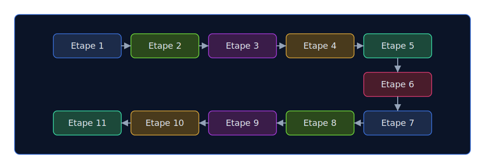

Ligne 1 : gauche &rarr; droite. Descente &agrave; la fin. Ligne 2 : droite &rarr; gauche. Le flux serpente.

---

<!-- transition: flip -->
<!-- _class: compact -->

## Pattern 6 — Feedback externe

**Quand :** il y a une boucle (retour, auto-amelioration). **Ne jamais** mettre la fleche retour dans le flux principal.


Le node `LOOP` est place **en dehors** du flux principal. Fleches pointillees `-.ajuste.->` et `-.echec.->` pour distinguer du flux normal.

---

<!-- _class: compact -->

## Anti-pattern — Feedback inline (a eviter)

Meme idee que Pattern 5 mais avec la fleche retour dans le flux principal `D --> A` :


<div class="box la l1-red">
<strong>Probleme :</strong> l'algo de layout de Mermaid reordonne les nodes pour minimiser les croisements. Avec une fleche retour, l'ordre visuel ne correspond plus au flux logique. Preferer Pattern 5.
</div>

---

<!-- transition: flip -->
<!-- _class: compact -->

## Autres types Mermaid — Processus & Data

Au-dela des `graph/flowchart`, Mermaid gere nativement :

<div class="box la l1-blue"><strong>Gantt</strong> — roadmap projet avec dates + sections + etats (done/active/crit)</div>
<div class="box la l1-green"><strong>Timeline</strong> — chronologie historique (annees/evenements)</div>
<div class="box la l1-violet"><strong>SequenceDiagram</strong> — interactions entre acteurs (synchrones/asynchrones)</div>
<div class="box la l1-orange"><strong>Journey</strong> — parcours utilisateur avec score de satisfaction</div>

---

<!-- _class: compact -->

## Autres types Mermaid — Structure & Analyse

<div class="box la l1-cyan"><strong>Pie</strong> — camembert proportions</div>
<div class="box la l1-red"><strong>StateDiagram</strong> — machine a etats + transitions</div>
<div class="box la l1-blue"><strong>ERDiagram</strong> — entite-relation (schema BDD)</div>
<div class="box la l1-violet"><strong>QuadrantChart</strong> — matrice 2x2 (priorisation impact/effort)</div>

---

<!-- _class: compact -->

## Gantt — Roadmap projet

**Quand :** planification avec dates, dependances, etats (done/active/crit).

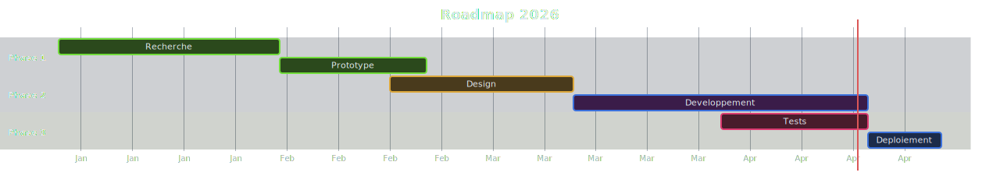

`gantt` + `dateFormat` + sections. Etats : `done`, `active`, `crit`. Dependances via `after taskId`.

---

<!-- _class: compact -->

## Timeline — Chronologie

**Quand :** afficher une sequence d'evenements sur une echelle de temps (annees, phases, jalons).

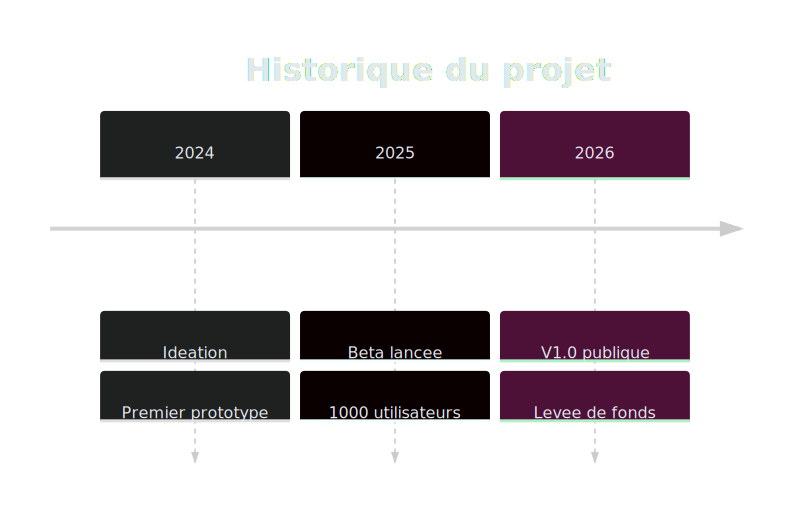

`timeline` + annee/phase + evenements separes par `:`.

---

<!-- transition: flip -->
<!-- _class: compact -->

## SequenceDiagram — Interactions

**Quand :** representer les echanges entre acteurs/systemes dans l'ordre chronologique.

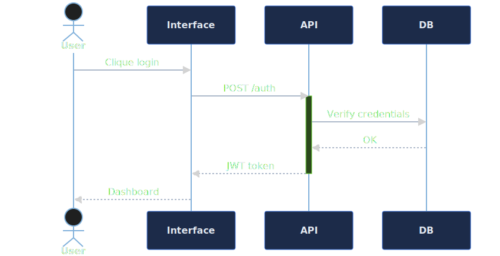

`sequenceDiagram` + `actor`/`participant` + fleches `->>` (sync) / `-->>` (async). `activate/deactivate` pour montrer l'etat actif.

---

<!-- _class: compact -->

## Journey — Parcours utilisateur

**Quand :** visualiser l'experience utilisateur avec scores de satisfaction (1-5) par etape.


`journey` + sections + `etape: score: acteur`. Pratique pour UX reviews et retrospectives.

---

<!-- transition: flip -->
<!-- _class: compact -->

## Pie — Repartition

**Quand :** montrer des proportions d'un tout (budget, temps, ressources).

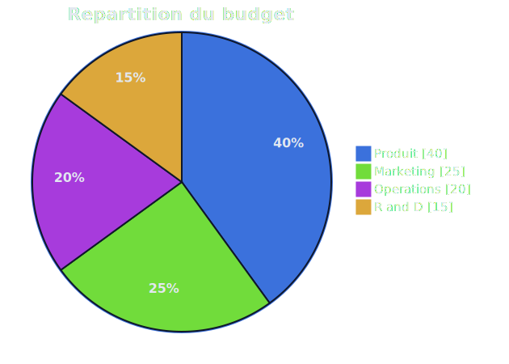

`pie showData` + title + entrees `"label" : valeur`. Max 6-7 tranches pour rester lisible.

---

<!-- _class: compact -->

## StateDiagram — Machine a etats

**Quand :** modeliser un systeme avec etats distincts + transitions nommees (UI, workflow, protocole).


`stateDiagram-v2` + `[*]` pour debut/fin + `etat1 --> etat2 : event`.

---

<!-- transition: flip -->
<!-- _class: compact -->

## ERDiagram — Entite-Relation

**Quand :** documenter un schema de base de donnees (tables + relations + cardinalites).

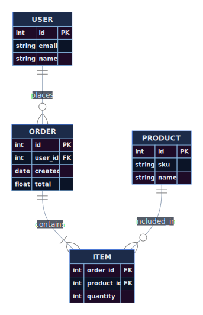

`erDiagram` + `ENTITE1 ||--o{ ENTITE2 : relation`. Cardinalites : `||` (un), `o{` (zero ou plusieurs), `|{` (un ou plusieurs).

---

<!-- _class: compact -->

## QuadrantChart — Priorisation

**Quand :** matrice 2x2 pour prioriser (impact/effort, urgence/importance).

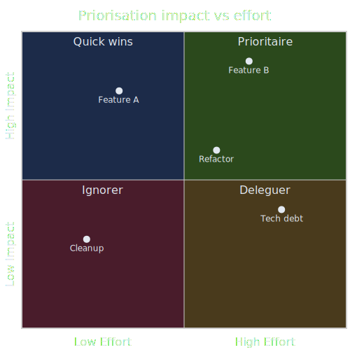

`quadrantChart` + axes + `quadrant-1..4` labels + points `Label: [x, y]` (0-1).

---

<!-- _class: compact -->

## Imbrication — 3 niveaux

Meme couleur, 3 intensites. Usage : grouper visuellement des elements imbriques.

<div class="box l1-blue" style="padding: 1rem;">
<div style="font-weight: 800; margin-bottom: 0.6rem;">Level 1 — Cadre principal (standalone)</div>
<div class="box l2-blue" style="padding: 0.7rem;">
<div style="font-weight: 800; margin-bottom: 0.5rem; font-size: 0.9em;">Level 2 — Element imbrique</div>
<div class="box l3-blue" style="padding: 0.5rem; font-size: 0.82em;">
<strong>Level 3</strong> — Sous-element (tag, badge, detail)
</div>
</div>
</div>

Chaque niveau : fond plus clair, bordure plus douce. Cf classes <code>.l1-*</code> <code>.l2-*</code> <code>.l3-*</code>.

---

<!-- _class: compact -->

## Palette — Genere via HSL (gen_palette.py)

| Variable | Dark | Light | Usage |
|----------|------|-------|-------|
| `--bg` | `#0f172a` | `#f1f5f9` | Fond slide |
| `--text` | `#e2e8f0` | `#1e293b` | Corps de texte |
| `--title` | `#a3bef4` | `#163a82` | Titres H2 |
| `--l1-blue-bg` | `#0b1427` | `#dfe6f5` | Cadre L1 bleu `hsl(220, 55%, 10% / 92%)` |
| `--l2-blue-bg` | `#1c2b49` | `#c7d3e9` | Cadre L2 bleu `hsl(220, 45%, 20% / 85%)` |
| `--l3-blue-bg` | `#304672` | `#a5b6d8` | Cadre L3 bleu `hsl(220, 40%, 32% / 75%)` |
| `--blue-strong` | `#a3bef4` | `#163a82` | Texte strong `hsl(220, 80%, 80% / 30%)` |

Systeme parametrique : N familles equidistantes a 360°/N. Cf slide suivante.

---

<!-- _class: compact -->

## Systeme colorimetrique HSL

Hue reparti equidistant (step = 360°/N). Saturation et luminosite **constantes par niveau** sur toutes les familles. Light mode = inversion symetrique.

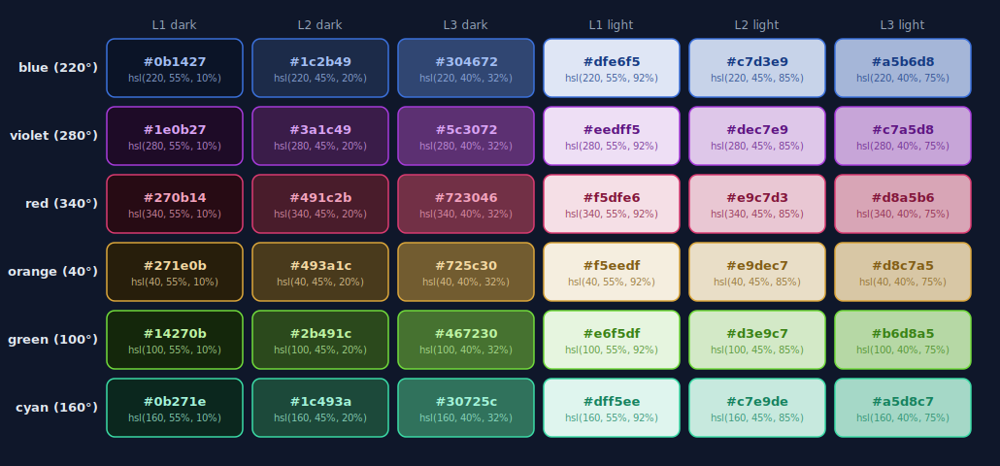

6 familles × 3 niveaux × 2 modes. Parametres dans `gen_palette.py`.

---

<!-- _class: compact -->

## Transitions

| Contexte | Transition | Quand |
|----------|-----------|-------|
| **Standard** | `fade` | Entre slides normales |
| **Donnees** | `flip` | Tableaux, KPIs, resultats |
| **Section break** | `fade-out` | Changement d'acte |

---

<!-- _paginate: false -->
<!-- transition: fade-out -->

<div style="display: flex; flex-direction: column; justify-content: center; align-items: center; text-align: center; height: 100%;">
<h2 style="color: var(--lead-h1); border: none; font-size: 2em; margin-bottom: 1rem; text-shadow: 0 0 25px rgba(163,190,244,0.4);">Standard — Neon Edition</h2>
<div style="font-size: 1em; color: var(--text); line-height: 1.8;">
Fond sombre — Glass-morphism rgba<br>
Glow subtil sur titres, cards, bordures<br>
Transitions : fade / flip / fade-out<br>
Diagrammes : SVG dark transparent
</div>
</div>
